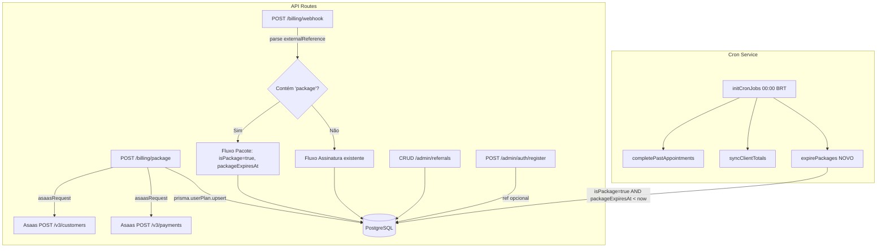

# Documento de Design — Backend: Planos, Pacotes e Referências

## Visão Geral

Este design cobre as alterações no backend (trinity-scheduler-core) para suportar:

1. **Pacotes Mensais**: Novo campo `packagePrice` no Plan, campos `isPackage`/`packageExpiresAt` no UserPlan, endpoint POST /billing/package para pagamento avulso via Asaas Payments API, e cron job de expiração.
2. **Webhook Atualizado**: Distinção entre pagamentos de assinatura e pacote no webhook existente, baseada no formato do `externalReference`.
3. **Referral CRUD**: Novo modelo Referral com endpoints admin (GET, POST, PUT, DELETE) sem tenantFilter (global), com paginação e busca case-insensitive.
4. **Associação de Referência no Registro**: Campo opcional `ref` no POST /admin/auth/register que associa o User ao Referral correspondente.

O design segue os padrões existentes: Express Router com async handlers + `next(err)`, `AppError` para erros, `parsePagination`/`createPaginatedResponse` para paginação, `asaasRequest` para chamadas Asaas, e `authMiddleware` + `authorize()` para autenticação/autorização.

## Arquitetura



### Decisões de Arquitetura

1. **externalReference com prefixo "package"**: O formato `kronuz:package:{userId}:{planId}` permite ao webhook distinguir pacotes de assinaturas (`kronuz:{userId}:{planId}`) sem alterar o fluxo existente. O webhook faz split por `:` e verifica se o segundo segmento é "package".

2. **Referrals sem tenantFilter**: Referências são globais (não pertencem a um shop). O router é montado com `authMiddleware` + `authorize('admin')` mas sem `tenantFilter`, seguindo o padrão de `adminPlansRouter` e `adminUsersRouter`.

3. **expirePackages no cron existente**: Adicionado à rotina diária existente (00:00 America/Sao_Paulo) junto com `completePastAppointments` e `syncClientTotals`, mantendo um único ponto de entrada para jobs diários.

4. **packagePrice separado de price**: Permite precificação independente entre assinatura recorrente e pacote avulso sem quebrar o fluxo de billing existente.

5. **Code em lowercase**: O campo `code` do Referral é armazenado em lowercase no POST/PUT para garantir unicidade case-insensitive sem depender de collation do banco.

## Componentes e Interfaces

### Arquivos Modificados

| Arquivo | Modificação |
|---|---|
| `prisma/schema.prisma` | Adicionar `packagePrice` ao Plan, `isPackage`/`packageExpiresAt` ao UserPlan, modelo Referral, `referralId` ao User |
| `prisma/seed/data.ts` | Adicionar `packagePrice` ao array PLANS |
| `prisma/seed.ts` | Incluir `packagePrice` no upsert de planos |
| `src/routes/admin/plans.routes.ts` | Aceitar `packagePrice` no PATCH, retornar `isPackage`/`packageExpiresAt` no GET /plans/me |
| `src/routes/billing.routes.ts` | Novo endpoint POST /billing/package, atualizar webhook handler |
| `src/services/cron.service.ts` | Nova função `expirePackages`, adicionar ao `initCronJobs` |
| `src/routes/admin/auth.routes.ts` | Aceitar `ref` no POST /register, buscar Referral e associar |
| `src/routes/index.ts` | Montar novo router de referrals |

### Arquivos Novos

| Arquivo | Descrição |
|---|---|
| `src/routes/admin/referrals.routes.ts` | CRUD completo de Referrals (GET list, GET by id, POST, PUT, DELETE) |

### Especificação dos Endpoints

#### POST /billing/package

- **Auth**: `authMiddleware` + `authorize('leader', 'admin')`
- **Request Body**:
```typescript
{
  planId: string;
  billingType: "BOLETO" | "CREDIT_CARD" | "PIX";
  name: string;
  cpfCnpj: string;
  email: string;
  phone: string;
  postalCode: string;
  addressNumber: string;
  remoteIp?: string;
  creditCard?: {           // obrigatório se billingType === "CREDIT_CARD"
    holderName: string;
    number: string;
    expiryMonth: string;
    expiryYear: string;
    ccv: string;
  };
  creditCardHolderInfo?: { // obrigatório se billingType === "CREDIT_CARD"
    name: string;
    email: string;
    cpfCnpj: string;
    postalCode: string;
    addressNumber: string;
    phone: string;
  };
}
```
- **Response 200**: `{ paymentId: string }`
- **Response 400**: Campo obrigatório ausente
- **Response 404**: Plano não encontrado
- **Response 502**: Erro na API do Asaas

**Fluxo interno**:
1. Validar campos obrigatórios
2. Buscar Plan por planId (404 se não existe)
3. `asaasRequest('POST', '/customers', { name, cpfCnpj, email, phone, postalCode })`
4. Construir payload de pagamento com `externalReference: "kronuz:package:{userId}:{planId}"`
5. Se CREDIT_CARD: incluir creditCard + creditCardHolderInfo (sanitizados)
6. `asaasRequest('POST', '/payments', payload)`
7. `prisma.userPlan.upsert({ where: { userId }, create/update: { planId, isPackage: true, packageExpiresAt: now+30d, subscriptionStatus: 'ACTIVE' } })`
8. Retornar `{ paymentId }`

#### PATCH /admin/plans/:planId (atualização)

Adicionar `packagePrice` aos campos aceitos no body, seguindo o mesmo padrão de `price`, `unitLimit`, `professionalLimit`.

#### GET /plans/me (atualização)

Incluir `isPackage` e `packageExpiresAt` na resposta JSON.

#### POST /billing/webhook (atualização)

Após extrair `externalReference`, verificar se contém "package":
- **Formato pacote**: `kronuz:package:{userId}:{planId}` → split por `:` → `[_, 'package', userId, planId]`
- **Formato assinatura**: `kronuz:{userId}:{planId}` → split por `:` → `[_, userId, planId]`

Para pacote + PAYMENT_CONFIRMED: `updateMany({ where: { userId }, data: { planId, isPackage: true, packageExpiresAt: now+30d, subscriptionStatus: 'ACTIVE' } })`
Para pacote + PAYMENT_OVERDUE: `updateMany({ where: { userId }, data: { subscriptionStatus: 'INACTIVE' } })`

#### GET /admin/referrals

- **Auth**: `authMiddleware` + `authorize('admin')` (sem tenantFilter)
- **Query Params**: `search?`, `page?`, `pageSize?`
- **Response 200**: `{ data: Referral[], total, page, pageSize, totalPages }`
- Filtro: `code contains search (mode: insensitive)`
- Ordenação: `createdAt desc`

#### GET /admin/referrals/:id

- **Auth**: `authMiddleware` + `authorize('admin')`
- **Response 200**: `Referral`
- **Response 404**: Referência não encontrada

#### POST /admin/referrals

- **Auth**: `authMiddleware` + `authorize('admin')`
- **Request Body**: `{ code: string, commissionType: string, commissionValue: number }`
- **Response 201**: `Referral` (code armazenado em lowercase)
- **Response 409**: Código já existe

#### PUT /admin/referrals/:id

- **Auth**: `authMiddleware` + `authorize('admin')`
- **Request Body**: `{ code: string, commissionType: string, commissionValue: number }`
- **Response 200**: `Referral`
- **Response 404**: Referência não encontrada
- **Response 409**: Código já existe em outra referência

#### DELETE /admin/referrals/:id

- **Auth**: `authMiddleware` + `authorize('admin')`
- **Response 204**: Excluído
- **Response 404**: Referência não encontrada

#### POST /admin/auth/register (atualização)

Aceitar campo opcional `ref` no body. Dentro da transação:
1. Se `ref` fornecido: `prisma.referral.findFirst({ where: { code: ref.toLowerCase() } })`
2. Se encontrado: incluir `referralId` no `prisma.user.create()`
3. Se não encontrado ou não fornecido: prosseguir normalmente

## Modelos de Dados

### Alterações no Prisma Schema

```prisma
model Plan {
  id                String   @id
  name              String
  price             Int
  packagePrice      Int      @default(0)  // NOVO — preço do pacote mensal (centavos)
  unitLimit         Int
  professionalLimit Int
  createdAt         DateTime @default(now())
  updatedAt         DateTime @updatedAt

  userPlans UserPlan[]
}

model UserPlan {
  id                 String             @id @default(uuid())
  userId             String             @unique
  planId             String
  subscriptionId     String?
  subscriptionStatus SubscriptionStatus @default(TRIAL)
  isPackage          Boolean            @default(false)    // NOVO
  packageExpiresAt   DateTime?                             // NOVO
  createdAt          DateTime           @default(now())
  updatedAt          DateTime           @updatedAt

  user User @relation(fields: [userId], references: [id])
  plan Plan @relation(fields: [planId], references: [id])
}

model Referral {
  id              String   @id @default(uuid())
  code            String   @unique
  commissionType  String   // "percentage" | "fixed"
  commissionValue Int      // centavos para fixed, inteiro para percentage
  createdAt       DateTime @default(now())
  updatedAt       DateTime @updatedAt

  users User[]
}

model User {
  id             String    @id @default(uuid())
  shopId         String
  name           String
  email          String    @unique
  passwordHash   String
  role           Role      @default(leader)
  professionalId String?   @unique
  referralId     String?                        // NOVO
  resetToken     String?
  resetTokenExp  DateTime?
  createdAt      DateTime  @default(now())
  updatedAt      DateTime  @updatedAt

  shop         Shop          @relation(fields: [shopId], references: [id])
  professional Professional? @relation(fields: [professionalId], references: [id])
  userPlan     UserPlan?
  referral     Referral?     @relation(fields: [referralId], references: [id])  // NOVO
}
```

### Seed Data (data.ts)

```typescript
export const PLANS = [
  { id: 'FREE',    name: 'Free',    price: 0,    packagePrice: 0,     unitLimit: 1,  professionalLimit: 3  },
  { id: 'PREMIUM', name: 'Premium', price: 2999, packagePrice: 3999,  unitLimit: 2,  professionalLimit: 8  },
  { id: 'PRO',     name: 'Pro',     price: 9999, packagePrice: 12999, unitLimit: 5,  professionalLimit: 30 },
  { id: 'ADMIN',   name: 'Admin',   price: 0,    packagePrice: 0,     unitLimit: -1, professionalLimit: -1 },
];
```

### Funções Auxiliares

```typescript
// billing.routes.ts — nova função
export function buildPackageExternalReference(userId: string, planId: string): string {
  return `kronuz:package:${userId}:${planId}`;
}

// billing.routes.ts — helper para parsing
export function parseExternalReference(ref: string): { isPackage: boolean; userId: string; planId: string } | null {
  if (!ref.startsWith('kronuz:')) return null;
  const parts = ref.split(':');
  if (parts[1] === 'package' && parts.length >= 4) {
    return { isPackage: true, userId: parts[2], planId: parts[3] };
  }
  if (parts.length >= 3) {
    return { isPackage: false, userId: parts[1], planId: parts[2] };
  }
  return null;
}
```

## Propriedades de Corretude

*Uma propriedade é uma característica ou comportamento que deve ser verdadeiro em todas as execuções válidas de um sistema — essencialmente, uma declaração formal sobre o que o sistema deve fazer. Propriedades servem como ponte entre especificações legíveis por humanos e garantias de corretude verificáveis por máquina.*


### Propriedade 1: Round-trip de parsing do externalReference

*Para qualquer* userId (string UUID) e planId (string não-vazia), construir um externalReference de pacote com `buildPackageExternalReference(userId, planId)` e depois fazer parsing com `parseExternalReference()` deve retornar `{ isPackage: true, userId, planId }`. Da mesma forma, construir um externalReference de assinatura com `buildExternalReference(userId, planId)` e fazer parsing deve retornar `{ isPackage: false, userId, planId }`.

**Valida: Requisitos 5.1, 5.3**

### Propriedade 2: Webhook sempre retorna 200

*Para qualquer* payload de webhook (evento válido ou inválido, externalReference presente ou ausente), o endpoint POST /billing/webhook deve retornar status HTTP 200.

**Valida: Requisito 5.4**

### Propriedade 3: expirePackages reseta apenas pacotes expirados

*Para qualquer* conjunto de UserPlans onde alguns têm `isPackage=true` com `packageExpiresAt` no passado e outros com `packageExpiresAt` no futuro, a função `expirePackages` deve resetar apenas os expirados para `{ planId: 'FREE', isPackage: false, packageExpiresAt: null, subscriptionStatus: 'TRIAL' }` e manter os não-expirados inalterados.

**Valida: Requisitos 4.1, 4.2**

### Propriedade 4: Referral code — lowercase e unicidade case-insensitive

*Para qualquer* string alfanumérica como code, ao criar um Referral via POST /admin/referrals, o code armazenado deve ser `code.toLowerCase()`. Além disso, para qualquer variação de case do mesmo code (ex: "ABC", "abc", "Abc"), tentar criar um segundo Referral deve resultar em erro 409.

**Valida: Requisitos 7.7, 7.9, 7.12**

### Propriedade 5: Busca de referências por code é case-insensitive

*Para qualquer* Referral existente com code `c` e qualquer variação de case de uma substring de `c` como parâmetro `search`, o endpoint GET /admin/referrals deve incluir esse Referral nos resultados.

**Valida: Requisito 7.2**

### Propriedade 6: Paginação de referências respeita limites

*Para quaisquer* valores válidos de `page` e `pageSize`, o endpoint GET /admin/referrals deve retornar no máximo `pageSize` itens, com `totalPages = ceil(total / pageSize)`, e os itens devem estar ordenados por `createdAt` descendente.

**Valida: Requisito 7.3**

### Propriedade 7: Registro com ref — busca case-insensitive

*Para qualquer* Referral existente com code `c` e qualquer variação de case de `c` como campo `ref` no POST /admin/auth/register, o User criado deve ter `referralId` igual ao ID do Referral correspondente.

**Valida: Requisitos 8.2, 8.3**

### Propriedade 8: Validação de campos obrigatórios no POST /billing/package

*Para qualquer* subconjunto dos campos obrigatórios (planId, billingType, name, cpfCnpj, email, phone, postalCode, addressNumber) onde pelo menos um campo está ausente, o endpoint POST /billing/package deve retornar status 400 com mensagem indicando o campo ausente.

**Valida: Requisito 3.10**

## Tratamento de Erros

Todos os erros seguem o padrão existente com `AppError(statusCode, code, message)` e `next(err)`.

| Cenário | Status | Code | Mensagem |
|---|---|---|---|
| Campo obrigatório ausente (package) | 400 | VALIDATION_ERROR | "Campo {field} é obrigatório" |
| Plano não encontrado (package) | 404 | NOT_FOUND | "Plano não encontrado" |
| Erro Asaas (customer/payment) | 502 | ASAAS_ERROR | Mensagem do Asaas |
| creditCard ausente para CREDIT_CARD | 400 | VALIDATION_ERROR | "Campo creditCard é obrigatório" |
| creditCardHolderInfo ausente para CREDIT_CARD | 400 | VALIDATION_ERROR | "Campo creditCardHolderInfo é obrigatório" |
| Referência não encontrada | 404 | NOT_FOUND | "Referência não encontrada" |
| Código de referência duplicado | 409 | CONFLICT | "Código já existe" |
| Nenhum campo para atualizar (plans) | 400 | VALIDATION_ERROR | "Nenhum campo para atualizar" |

O webhook sempre retorna `{ received: true }` com status 200, mesmo em caso de erro interno (para evitar retry loop do Asaas).

## Estratégia de Testes

### Testes de Propriedade (Vitest + fast-check)

Biblioteca: `fast-check` (já instalado no projeto).
Configuração: mínimo 100 iterações por propriedade.

Cada teste deve ser tagueado com comentário referenciando a propriedade do design:

```typescript
// Feature: backend-plans-packages-referrals, Property 1: Round-trip de parsing do externalReference
test.prop([fc.uuid(), fc.stringOf(fc.constantFrom(...'ABCDEFGHIJKLMNOPQRSTUVWXYZ'), { minLength: 1, maxLength: 10 })], (userId, planId) => {
  const packageRef = buildPackageExternalReference(userId, planId);
  const parsed = parseExternalReference(packageRef);
  expect(parsed).toEqual({ isPackage: true, userId, planId });

  const subRef = buildExternalReference(userId, planId);
  const parsedSub = parseExternalReference(subRef);
  expect(parsedSub).toEqual({ isPackage: false, userId, planId });
}, { numRuns: 100 });
```

As propriedades 2–8 envolvem interação com banco/HTTP e devem ser testadas com mocks de Prisma e supertest, mantendo 100 iterações para as que são funções puras (Properties 1, 4) e testes de integração com exemplos representativos para as demais.

### Testes Unitários (Vitest)

Testes de exemplo e edge cases:

- **POST /billing/package**: Fluxo completo com mock do Asaas (BOLETO, PIX, CREDIT_CARD), planId inexistente (404), erro Asaas (502), campos ausentes (400)
- **Webhook**: PAYMENT_CONFIRMED para pacote, PAYMENT_OVERDUE para pacote, distinção pacote vs assinatura, externalReference inválido
- **expirePackages**: Pacotes expirados resetados, pacotes válidos mantidos, nenhum pacote expirado
- **CRUD Referrals**: Criação, listagem com busca, atualização, exclusão, código duplicado (409), não encontrado (404)
- **Registro com ref**: ref válido associa, ref inválido ignora, sem ref ignora
- **PATCH /admin/plans/:planId**: Aceita packagePrice
- **GET /plans/me**: Retorna isPackage e packageExpiresAt

### Testes de Integração

- Fluxo completo de compra de pacote (mock Asaas) → webhook confirma → GET /plans/me retorna isPackage=true
- Fluxo de expiração: criar pacote expirado → rodar expirePackages → verificar reset para FREE
- CRUD completo de referrals: criar → listar → buscar → atualizar → deletar

### Cobertura por Requisito

| Requisito | Tipo de Teste |
|---|---|
| 1 (packagePrice no Plan) | Integração + Smoke |
| 2 (isPackage/packageExpiresAt no UserPlan) | Integração |
| 3 (POST /billing/package) | Unitário + Integração + Propriedade (P1, P8) |
| 4 (Cron expirePackages) | Unitário + Propriedade (P3) |
| 5 (Webhook pacote) | Unitário + Propriedade (P1, P2) |
| 6 (Modelo Referral) | Smoke |
| 7 (CRUD Referrals) | Unitário + Integração + Propriedade (P4, P5, P6) |
| 8 (ref no registro) | Unitário + Propriedade (P7) |
| 9 (Swagger) | Smoke |
