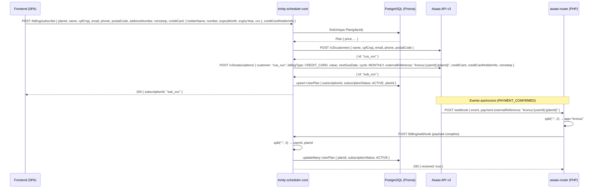

# Design Document — direct-subscription-billing

## Overview

Esta feature substitui o fluxo de Checkout Session do Asaas por um fluxo direto de criação de customer + subscription via API do Asaas v3. O objetivo é eliminar o redirecionamento para página externa, coletar dados diretamente no frontend do Kronuz e garantir que o `externalReference` da subscription seja sempre `kronuz:{userId}:{planId}` — sem fallbacks de lookup posterior.

**Componentes afetados:**
- `trinity-scheduler-core/src/routes/billing.routes.ts` — novo endpoint `POST /billing/subscribe`, remoção de `POST /billing/checkout`, simplificação do webhook handler
- `trinity-scheduler-core/.env.example` — limpeza de variáveis obsoletas
- Frontend (SPA admin) — modal de assinatura com coleta de dados do cartão enviados ao backend via HTTPS

## Architecture



### Decisões de design

**Por que usar `POST /v3/subscriptions/` (com barra) e não `POST /v3/subscriptions`?**
O Asaas tem dois endpoints distintos: `POST /v3/subscriptions` (sem cartão) e `POST /v3/subscriptions/` (com cartão — `SubscriptionSaveWithCreditCardRequestDTO`). O segundo aceita `creditCard`, `creditCardHolderInfo` e `remoteIp` diretamente, eliminando a necessidade de tokenização separada. O fluxo fica em apenas 2 chamadas à API.

**Por que criar customer antes da subscription?**
O `POST /v3/subscriptions/` exige o campo `customer` (id do customer Asaas). O customer precisa existir antes.

**Por que `externalReference: kronuz:{userId}:{planId}` em vez de apenas `kronuz:{userId}`?**
O webhook `PAYMENT_CONFIRMED` precisa atualizar o `UserPlan` com o `planId` correto. Com o formato anterior (`kronuz:{userId}`), o handler não sabia qual plano confirmar. O novo formato elimina a necessidade de lookup adicional na API Asaas.

**Por que o asaas-router não precisa de alteração?**
O router faz `explode(':', $external_ref, 2)` — split no primeiro `:` com limite 2. Isso resulta em `app = "kronuz"` e `id = "{userId}:{planId}"`. O payload completo (incluindo `externalReference` original) é encaminhado ao core, que faz seu próprio split com limite 3.

**Por que remover o fallback de lookup no webhook?**
O fallback (`GET /subscriptions/{id}`) foi necessário quando o `externalReference` podia vir vazio. Com o novo fluxo, toda subscription criada pelo `POST /billing/subscribe` terá `externalReference` no formato correto. Eventos de subscriptions antigas (sem externalReference) são silenciosamente ignorados com log de aviso.

## Components and Interfaces

### POST /billing/subscribe

**Middleware chain:** `authMiddleware` → `authorize('leader', 'admin')` → handler

**Request body:**
```typescript
interface SubscribeRequest {
  planId: string;                      // obrigatório
  name: string;                        // obrigatório — nome do customer no Asaas
  cpfCnpj: string;                     // obrigatório — CPF (11 dígitos) ou CNPJ (14 dígitos)
  email: string;                       // obrigatório
  phone?: string;                      // opcional
  postalCode: string;                  // obrigatório — exigido pelo creditCardHolderInfo
  addressNumber: string;               // obrigatório — exigido pelo creditCardHolderInfo
  remoteIp: string;                    // obrigatório — IP do cliente (enviado pelo frontend via header ou body)
  creditCard: {
    holderName: string;                // obrigatório
    number: string;                    // obrigatório
    expiryMonth: string;               // obrigatório — 2 dígitos
    expiryYear: string;                // obrigatório — 4 dígitos
    ccv: string;                       // obrigatório
  };
  creditCardHolderInfo: {
    name: string;                      // obrigatório
    email: string;                     // obrigatório
    cpfCnpj: string;                   // obrigatório
    postalCode: string;                // obrigatório
    addressNumber: string;             // obrigatório
    addressComplement?: string;        // opcional
    phone: string;                     // obrigatório
    mobilePhone?: string;              // opcional
  };
}
```

**Response (200):**
```typescript
{ subscriptionId: string }
```

**Fluxo interno (2 passos na API Asaas):**
1. Validar campos obrigatórios → 400 `VALIDATION_ERROR` se ausentes
2. `prisma.plan.findUnique({ where: { id: planId } })` → 404 `NOT_FOUND` se não encontrado
3. `POST /v3/customers` → 502 `ASAAS_ERROR` se falhar
4. `POST /v3/subscriptions/` (com barra) com `creditCard`, `creditCardHolderInfo`, `remoteIp` e `externalReference: kronuz:{userId}:{planId}` → 502 `ASAAS_ERROR` se falhar
5. `prisma.userPlan.upsert({ where: { userId }, update: { subscriptionId, subscriptionStatus: 'ACTIVE', planId }, create: { ... } })`
6. Retornar `{ subscriptionId }`

**Payload para `POST /v3/subscriptions/`:**
```typescript
{
  customer: customerId,          // "cus_xxx" retornado pelo passo 3
  billingType: 'CREDIT_CARD',
  value: plan.price / 100,       // centavos → reais
  nextDueDate: today_sp,         // data atual em America/Sao_Paulo, formato YYYY-MM-DD
  cycle: 'MONTHLY',
  externalReference: `kronuz:${userId}:${planId}`,
  creditCard: {
    holderName: req.body.creditCard.holderName,
    number: req.body.creditCard.number,
    expiryMonth: req.body.creditCard.expiryMonth,
    expiryYear: req.body.creditCard.expiryYear,
    ccv: req.body.creditCard.ccv,
  },
  creditCardHolderInfo: req.body.creditCardHolderInfo,
  remoteIp: req.body.remoteIp,
}
```

**Segurança:** os dados brutos do cartão (`creditCard.number`, `creditCard.ccv`) nunca são logados nem persistidos — passados diretamente ao Asaas e descartados.

### POST /billing/webhook (simplificado)

**Mudança:** remoção do bloco de fallback que faz `GET /subscriptions/{subscriptionId}`.

**Novo fluxo de parsing:**
```typescript
// Extrai externalReference do payload
const externalReference = payment?.externalReference ?? subscription?.externalReference;

// Valida prefixo
if (!externalReference?.startsWith('kronuz:')) {
  console.warn(`[billing/webhook] externalReference inválido: ${externalReference}`);
  return res.status(200).json({ received: true });
}

// Parse: "kronuz:{userId}:{planId}" → split com limite 3
const [, userId, planId] = externalReference.split(':', 3);
```

**Eventos processados:**
- `PAYMENT_CONFIRMED` → `updateMany UserPlan { planId, subscriptionStatus: 'ACTIVE', subscriptionId }`
- `PAYMENT_OVERDUE` | `SUBSCRIPTION_DELETED` | `SUBSCRIPTION_INACTIVATED` → `updateMany UserPlan { subscriptionStatus: 'INACTIVE' }`
- Outros → ignorados silenciosamente

**Invariante:** sempre retorna HTTP 200, independentemente do resultado.

### POST /billing/checkout (removido)

O handler é removido completamente. Requisições para este endpoint passam a retornar 404 pelo Express (rota não registrada).

### Frontend — Subscription_Screen (Modal)

O formulário de assinatura é exibido em um **modal** sobreposto à tela de planos, ativado ao clicar em "Assinar" em um plano específico.

**Estrutura do modal:**
- Header: nome do plano + valor mensal (`R$ X,XX`) + botão de fechar (×)
- Body: formulário dividido em duas seções — "Dados pessoais" e "Dados do cartão"
- Footer: botão "Cancelar" (fecha modal) + botão "Confirmar assinatura" (submete)

**Campos do formulário:**

| Campo | Seção | Pré-preenchimento | Obrigatório |
|-------|-------|-------------------|-------------|
| `name` | Dados pessoais | `User.name` | sim |
| `email` | Dados pessoais | `User.email` | sim |
| `phone` | Dados pessoais | `Professional.phone` (se disponível) | sim |
| `cpfCnpj` | Dados pessoais | — | sim |
| `postalCode` | Dados pessoais | — | sim |
| `addressNumber` | Dados pessoais | — | sim |
| Número do cartão | Dados do cartão | — | sim |
| Nome no cartão | Dados do cartão | — | sim |
| Mês de validade | Dados do cartão | — | sim |
| Ano de validade | Dados do cartão | — | sim |
| CVV | Dados do cartão | — | sim |

> Nota: a tokenização ocorre no backend. O frontend envia os dados brutos do cartão via HTTPS. Não há SDK Asaas no frontend.

**Fluxo de submissão:**
1. Validar `cpfCnpj` (11 ou 14 dígitos após strip de formatação)
2. Capturar `remoteIp` do cliente (via `fetch('https://api.ipify.org?format=json')` ou equivalente)
3. Desabilitar botão + exibir loading
4. `POST /billing/subscribe` com todos os dados incluindo `creditCard` e `remoteIp`
5. Sucesso → fechar modal + exibir toast de sucesso na tela de planos
6. Erro → exibir mensagem de erro dentro do modal, reabilitar botão, manter campos preenchidos

**Comportamento do modal:**
- Fechar ao clicar no botão × ou em "Cancelar" — sem ação
- Fechar ao clicar no backdrop (fora do modal) — sem ação
- Não fechar durante loading (previne fechamento acidental)

## Data Models

Nenhuma alteração no schema Prisma é necessária. Os modelos existentes suportam o novo fluxo:

```prisma
model UserPlan {
  id                 String             @id @default(uuid())
  userId             String             @unique
  planId             String             // atualizado no PAYMENT_CONFIRMED com planId do externalReference
  subscriptionId     String?            // preenchido após criação da subscription
  subscriptionStatus SubscriptionStatus @default(TRIAL)
  // ...
}

enum SubscriptionStatus {
  TRIAL
  ACTIVE
  CONFIRMED
  INACTIVE
}
```

**Transição de status no UserPlan:**

```
TRIAL ──► ACTIVE  (POST /billing/subscribe com sucesso)
ACTIVE ──► INACTIVE  (PAYMENT_OVERDUE / SUBSCRIPTION_DELETED / SUBSCRIPTION_INACTIVATED)
INACTIVE ──► ACTIVE  (PAYMENT_CONFIRMED)
```

**Formato do externalReference:**

| Campo | Valor | Exemplo |
|-------|-------|---------|
| Prefixo | `kronuz` | — |
| userId | UUID v4 | `064c26e3-1234-5678-abcd-ef0123456789` |
| planId | string | `PREMIUM` |
| Completo | `kronuz:{userId}:{planId}` | `kronuz:064c26e3-...:PREMIUM` |
| Tamanho máximo esperado | ~51 chars | — |

## Correctness Properties

*A property is a characteristic or behavior that should hold true across all valid executions of a system — essentially, a formal statement about what the system should do. Properties serve as the bridge between human-readable specifications and machine-verifiable correctness guarantees.*

### Property 1: Falha na API Asaas retorna 502

*Para qualquer* requisição válida ao `POST /billing/subscribe`, se a API do Asaas retornar erro em qualquer etapa (criação de customer ou de subscription), o endpoint deve retornar HTTP 502 com `error: "ASAAS_ERROR"`.

**Validates: Requirements 1.4, 1.5**

---

### Property 2: Formato do externalReference

*Para qualquer* par `(userId, planId)` válido, o campo `externalReference` enviado à API Asaas na criação da subscription deve ser exatamente a string `kronuz:{userId}:{planId}`.

**Validates: Requirements 1.6**

---

### Property 3: Persistência após sucesso

*Para qualquer* assinatura criada com sucesso no Asaas, o registro `UserPlan` do usuário autenticado deve ser atualizado com o `subscriptionId` retornado pelo Asaas e `subscriptionStatus: ACTIVE`, e a resposta HTTP deve ser 200 com `{ subscriptionId }`.

**Validates: Requirements 1.7, 1.8**

---

### Property 4: planId inválido retorna 404

*Para qualquer* string que não corresponda a um `planId` existente no banco, o endpoint `POST /billing/subscribe` deve retornar HTTP 404 com `error: "NOT_FOUND"`.

**Validates: Requirements 1.3**

---

### Property 5: Webhook com externalReference inválido retorna 200 sem processar

*Para qualquer* evento de webhook com `externalReference` ausente ou sem prefixo `kronuz:`, o handler deve retornar HTTP 200 sem realizar nenhuma atualização no banco de dados e sem fazer chamadas à API do Asaas.

**Validates: Requirements 3.1, 3.2**

---

### Property 6: Parsing do externalReference no webhook

*Para qualquer* `externalReference` no formato `kronuz:{userId}:{planId}` (incluindo planIds com caracteres especiais ou hífens), o split com limite 3 deve extrair corretamente `userId` na posição 1 e `planId` na posição 2, sem truncar o planId.

**Validates: Requirements 3.3**

---

### Property 7: Webhook sempre retorna 200

*Para qualquer* evento de webhook recebido — válido, inválido, com erro de banco, com externalReference malformado — o handler deve sempre retornar HTTP 200.

**Validates: Requirements 3.4**

---

### Property 8: Autenticação obrigatória no subscribe

*Para qualquer* requisição ao `POST /billing/subscribe` sem JWT válido (ausente, expirado ou malformado), o endpoint deve retornar HTTP 401.

**Validates: Requirements 6.1**

---

### Property 9: Autorização por role no subscribe

*Para qualquer* usuário autenticado com role `professional`, o endpoint `POST /billing/subscribe` deve retornar HTTP 403.

**Validates: Requirements 6.2**

---

### Property 10: Validação de cpfCnpj no frontend

*Para qualquer* string que, após remoção de formatação (pontos, traços, barras), não tenha exatamente 11 dígitos (CPF) nem 14 dígitos (CNPJ), a tela de assinatura deve rejeitar a submissão e exibir mensagem de validação.

**Validates: Requirements 5.5**

---

## Error Handling

### Erros do endpoint POST /billing/subscribe

| Situação | HTTP | body |
|----------|------|------|
| JWT ausente/inválido | 401 | `{ error: "UNAUTHORIZED" }` |
| Role `professional` | 403 | `{ error: "FORBIDDEN" }` |
| Campo obrigatório ausente (`planId`, `cpfCnpj`, `name`, `email`, `phone`, `postalCode`, `addressNumber`, `remoteIp`, `creditCard.*`, `creditCardHolderInfo.*`) | 400 | `{ error: "VALIDATION_ERROR", message: "..." }` |
| `planId` não encontrado no banco | 404 | `{ error: "NOT_FOUND", message: "Plano não encontrado" }` |
| Falha na criação do Asaas Customer | 502 | `{ error: "ASAAS_ERROR", message: "<mensagem do Asaas>" }` |
| Falha na criação da Asaas Subscription | 502 | `{ error: "ASAAS_ERROR", message: "<mensagem do Asaas>" }` |
| Erro inesperado | 500 | `{ error: "INTERNAL_ERROR" }` (via errorHandler global) |

**Logging:** o handler não deve logar `creditCard.number`, `creditCard.ccv` nem o `cpfCnpj` completo. Apenas o `planId`, `userId` e a mensagem de erro do Asaas (sem dados sensíveis) devem aparecer nos logs.

### Erros do webhook

O webhook nunca retorna erro HTTP para o Asaas (sempre 200). Erros são logados internamente:
- `externalReference` inválido → `console.warn`
- Erro de banco → `console.error` + retorna 200

### Erros no frontend

- Resposta 4xx/5xx do backend → exibir `message` da resposta, manter campos, reabilitar botão
- Timeout/rede → exibir mensagem genérica de erro de conexão

## Testing Strategy

### Abordagem dual

A estratégia combina testes unitários (exemplos específicos e casos de borda) com testes baseados em propriedades (cobertura ampla de entradas via fast-check).

**Stack:** Vitest v2.1 + fast-check v3.23 + supertest v7.2

### Testes unitários (exemplos e casos de borda)

Localização: `src/routes/__tests__/billing.subscribe.test.ts`

**Casos a cobrir:**
- Requisição sem JWT → 401
- Requisição com role `professional` → 403
- Body sem `planId` → 400 `VALIDATION_ERROR`
- Body sem `cpfCnpj` → 400 `VALIDATION_ERROR`
- Body sem `creditCard` → 400 `VALIDATION_ERROR`
- Body sem `remoteIp` → 400 `VALIDATION_ERROR`
- `planId` inexistente → 404 `NOT_FOUND`
- Asaas customer retorna erro → 502 `ASAAS_ERROR`
- Asaas subscription retorna erro após customer criado → 502 `ASAAS_ERROR`
- Fluxo completo com sucesso → 200 `{ subscriptionId }`
- `POST /billing/checkout` → 404 (endpoint removido)
- Webhook com `externalReference` ausente → 200, sem update no banco
- Webhook com `externalReference` sem prefixo `kronuz:` → 200, sem update no banco
- Webhook `PAYMENT_CONFIRMED` com externalReference válido → UserPlan atualizado
- Webhook `SUBSCRIPTION_DELETED` → UserPlan com status INACTIVE

### Testes baseados em propriedades

Localização: `src/routes/__tests__/billing.subscribe.pbt.test.ts`

Cada property-based test deve rodar mínimo 100 iterações (configuração padrão do fast-check).

**Property 1 — Falha na API Asaas retorna 502**
```
// Feature: direct-subscription-billing, Property 1: Falha na API Asaas retorna 502
fc.property(
  fc.record({ planId: fc.constantFrom('PREMIUM', 'PRO'), ... }),
  fc.boolean(), // true = falha no customer, false = falha na subscription
  async (body, failAtCustomer) => { ... }
)
```

**Property 2 — Formato do externalReference**
```
// Feature: direct-subscription-billing, Property 2: Formato do externalReference
fc.property(
  fc.uuid(),           // userId
  fc.string({ minLength: 1 }), // planId
  (userId, planId) => {
    const ref = buildExternalReference(userId, planId);
    return ref === `kronuz:${userId}:${planId}`;
  }
)
```

**Property 4 — planId inválido retorna 404**
```
// Feature: direct-subscription-billing, Property 4: planId inválido retorna 404
fc.property(
  fc.string({ minLength: 1 }).filter(s => !['FREE','PREMIUM','PRO','ADMIN'].includes(s)),
  async (invalidPlanId) => { /* POST /billing/subscribe → expect 404 */ }
)
```

**Property 5 — Webhook com externalReference inválido retorna 200 sem processar**
```
// Feature: direct-subscription-billing, Property 5: Webhook externalReference inválido
fc.property(
  fc.oneof(fc.constant(''), fc.constant(null), fc.string().filter(s => !s.startsWith('kronuz:'))),
  fc.constantFrom('PAYMENT_CONFIRMED', 'PAYMENT_OVERDUE', 'SUBSCRIPTION_DELETED'),
  async (invalidRef, event) => { /* POST /billing/webhook → expect 200, no DB update */ }
)
```

**Property 6 — Parsing do externalReference**
```
// Feature: direct-subscription-billing, Property 6: Parsing do externalReference
fc.property(
  fc.uuid(),
  fc.stringMatching(/^[A-Z_]+$/),
  (userId, planId) => {
    const ref = `kronuz:${userId}:${planId}`;
    const [, parsedUserId, parsedPlanId] = ref.split(':', 3);
    return parsedUserId === userId && parsedPlanId === planId;
  }
)
```

**Property 7 — Webhook sempre retorna 200**
```
// Feature: direct-subscription-billing, Property 7: Webhook sempre retorna 200
fc.property(
  fc.record({ event: fc.string(), payment: fc.option(fc.record({ externalReference: fc.option(fc.string()) })) }),
  async (body) => { /* POST /billing/webhook → expect status 200 */ }
)
```

**Property 8 — Autenticação obrigatória**
```
// Feature: direct-subscription-billing, Property 8: Autenticação obrigatória
fc.property(
  fc.oneof(fc.constant(undefined), fc.string()),  // token inválido ou ausente
  async (invalidToken) => { /* POST /billing/subscribe → expect 401 */ }
)
```

**Property 9 — Autorização por role**
```
// Feature: direct-subscription-billing, Property 9: Autorização por role
fc.property(
  fc.record({ ... }), // body válido
  async (body) => { /* POST /billing/subscribe com JWT de professional → expect 403 */ }
)
```

**Property 10 — Validação de cpfCnpj no frontend**
```
// Feature: direct-subscription-billing, Property 10: Validação cpfCnpj
fc.property(
  fc.string().map(s => s.replace(/\D/g, '')).filter(s => s.length !== 11 && s.length !== 14),
  (invalidCpfCnpj) => {
    return validateCpfCnpj(invalidCpfCnpj) === false;
  }
)
```

### Cobertura esperada

| Camada | Ferramenta | Foco |
|--------|-----------|------|
| Lógica de parsing (`externalReference`) | fast-check | Properties 2, 6 |
| Validação de entrada do endpoint | fast-check + supertest | Properties 4, 8, 9 |
| Tratamento de erros Asaas | fast-check + mocks | Property 1 |
| Webhook handler | fast-check + supertest | Properties 5, 7 |
| Validação de cpfCnpj (frontend util) | fast-check | Property 10 |
| Fluxo completo (happy path) | supertest | Exemplos unitários |
| Remoção do checkout | supertest | Exemplo unitário |
