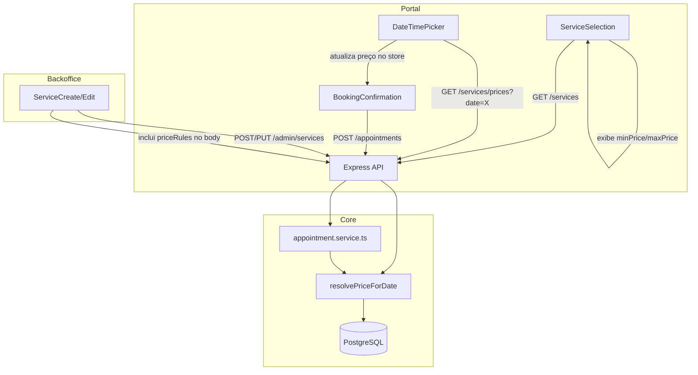

# Design — Precificação Dinâmica de Serviços

## Visão Geral

Esta funcionalidade adiciona suporte a preços diferenciados por dia da semana para serviços e adicionais. O sistema atual possui um campo `price` fixo no modelo `Service`. A solução introduz um modelo `ServicePriceRule` que associa um serviço a um conjunto de dias da semana e um preço em centavos. Quando não há regra para um dia específico, o `price` base do serviço é utilizado.

A implementação abrange três camadas:
1. **Core (backend)**: novo modelo Prisma, lógica de resolução de preço, endpoints CRUD e de consulta por data.
2. **Backoffice**: seção de regras de preço no formulário de criação/edição de serviço.
3. **Portal**: exibição de faixa de preço na listagem, resolução de preço ao selecionar data, e preço correto na confirmação.

O preço é sempre resolvido no backend e gravado no agendamento no momento da criação, garantindo que alterações futuras nas regras não afetem agendamentos existentes.

## Arquitetura



O fluxo principal:
- O **backoffice** envia as regras de preço junto com o payload de criação/edição do serviço.
- O **portal** recebe `minPrice` e `maxPrice` na listagem de serviços. Ao selecionar uma data, chama o endpoint de resolução de preço.
- Na criação do agendamento, o **core** resolve o preço com base no dia da semana da data e grava o valor final.

## Componentes e Interfaces

### Core (Backend)

#### Novo modelo Prisma: `ServicePriceRule`

Adicionado ao `schema.prisma` como relação 1:N com `Service`.

#### Função utilitária: `resolvePriceForDate`

```typescript
// core/src/utils/priceResolver.ts
function resolvePriceForDate(
  basePrice: number,
  priceRules: { dayOfWeek: number[]; price: number }[],
  date: string // "YYYY-MM-DD"
): number
```

Recebe o preço base, as regras e a data. Retorna o preço em centavos para o dia da semana correspondente. Se nenhuma regra cobrir o dia, retorna `basePrice`.

#### Função utilitária: `computePriceRange`

```typescript
// core/src/utils/priceResolver.ts
function computePriceRange(
  basePrice: number,
  priceRules: { price: number }[]
): { minPrice: number; maxPrice: number }
```

Calcula o menor e maior preço entre o preço base e todas as regras.

#### Endpoints modificados

| Endpoint | Mudança |
|---|---|
| `POST /admin/services` | Aceita `priceRules` no body; cria regras em transação |
| `PUT /admin/services/:id` | Aceita `priceRules`; faz delete+create das regras em transação |
| `GET /admin/services/:id` | Inclui `priceRules` na resposta |
| `GET /admin/services` | Inclui `priceRules` na resposta de cada serviço |
| `GET /services` (client) | Inclui `minPrice` e `maxPrice` calculados |
| `GET /services/prices?date=YYYY-MM-DD` (client, novo) | Retorna preços resolvidos de todos os serviços e addons para a data |

#### Modificação em `appointment.service.ts`

A função `createAppointment` passa a resolver o preço do serviço e de cada addon usando `resolvePriceForDate` antes de gravar.

### Backoffice (React)

#### `ServiceCreate.tsx` — Seção de Regras de Preço

Adicionada abaixo do campo de preço base. Cada regra é uma linha com:
- Chips/toggles para selecionar dias da semana (Dom–Sáb)
- Input de preço em R$
- Botão de remover regra
- Botão "Adicionar regra" no final

Validação client-side: impede dias duplicados entre regras antes do submit.

#### `serviceService.ts` (backoffice)

Os métodos `create` e `update` passam a incluir `priceRules` no payload, convertendo preços de reais para centavos. O `getById` mapeia as regras de centavos para reais.

### Portal (React)

#### Tipo `Service` atualizado

Adiciona campos opcionais `minPrice` e `maxPrice`.

#### `ServiceCard.tsx`

Exibe faixa de preço ("R$ 30 – R$ 45") quando `minPrice !== maxPrice`. Caso contrário, exibe preço único.

#### `serviceService.ts` (portal)

Nova função `getServicePrices(date: string)` que chama `GET /services/prices?date=...` e retorna os preços resolvidos.

#### `bookingStore.ts`

Novo estado `resolvedPrices: Record<string, number>` e action `setResolvedPrices`. Quando a data é selecionada, o componente de data/horário chama `getServicePrices` e atualiza o store.

#### `BookingConfirmation.tsx`

Usa o preço resolvido do store (se disponível) em vez do `service.price` fixo.

## Modelos de Dados

### Novo modelo: `ServicePriceRule`

```prisma
model ServicePriceRule {
  id        String   @id @default(uuid())
  serviceId String
  dayOfWeek Int[]    // array de inteiros 0-6 (dom-sáb)
  price     Int      // centavos, > 0

  service   Service  @relation(fields: [serviceId], references: [id], onDelete: Cascade)

  @@index([serviceId])
}
```

Relação adicionada ao modelo `Service`:
```prisma
model Service {
  // ... campos existentes
  priceRules ServicePriceRule[]
}
```

### Payload de criação/edição (admin)

```typescript
interface ServicePayload {
  name: string;
  duration: number;
  price: number; // preço base em centavos
  description?: string;
  image?: string;
  type: "service" | "addon";
  active?: boolean;
  priceRules?: {
    dayOfWeek: number[]; // ex: [1, 2] = seg, ter
    price: number;       // centavos
  }[];
}
```

### Resposta do endpoint de preço por data (client)

```typescript
// GET /services/prices?date=2025-03-15
interface PricesByDateResponse {
  date: string;
  dayOfWeek: number;
  prices: {
    serviceId: string;
    price: number; // centavos, resolvido para o dia
  }[];
}
```

### Resposta da listagem de serviços (client) — campos adicionados

```typescript
interface ServiceListItem {
  id: string;
  name: string;
  duration: number;
  price: number;      // preço base
  minPrice: number;    // menor entre base e regras
  maxPrice: number;    // maior entre base e regras
  description?: string;
  icon?: string;
  image?: string;
}
```


## Propriedades de Corretude

*Uma propriedade é uma característica ou comportamento que deve ser verdadeiro em todas as execuções válidas de um sistema — essencialmente, uma declaração formal sobre o que o sistema deve fazer. Propriedades servem como ponte entre especificações legíveis por humanos e garantias de corretude verificáveis por máquina.*

### Propriedade 1: Resolução de preço por dia da semana

*Para qualquer* serviço com preço base e conjunto de regras de preço, e *para qualquer* data válida, `resolvePriceForDate` deve retornar o preço da regra cujo `dayOfWeek` contém o dia da semana da data. Se nenhuma regra cobrir o dia, deve retornar o preço base.

**Valida: Requisitos 1.5, 3.1, 3.3, 5.1**

### Propriedade 2: Validação de regras de preço

*Para qualquer* array de dias da semana e preço, a validação deve aceitar a regra se e somente se todos os dias estiverem no intervalo [0, 6] e o preço for um inteiro maior que zero. Caso contrário, deve rejeitar com erro de validação.

**Valida: Requisitos 1.2, 1.3**

### Propriedade 3: Detecção de dias duplicados entre regras

*Para qualquer* conjunto de regras de preço de um mesmo serviço, a validação deve rejeitar o conjunto se e somente se existir algum dia da semana presente em mais de uma regra. Conjuntos sem sobreposição devem ser aceitos.

**Valida: Requisitos 1.4, 2.3**

### Propriedade 4: Preço total do agendamento é a soma dos preços resolvidos

*Para qualquer* serviço com regras de preço, *para qualquer* conjunto de adicionais (cada um com suas próprias regras), e *para qualquer* data válida, o preço total gravado no agendamento deve ser igual à soma de `resolvePriceForDate(serviço, data)` + Σ `resolvePriceForDate(adicional_i, data)`.

**Valida: Requisitos 4.1, 4.2, 4.3**

### Propriedade 5: Cálculo correto da faixa de preço

*Para qualquer* serviço com preço base e conjunto de regras de preço, `computePriceRange` deve retornar `minPrice` igual ao menor valor entre o preço base e todos os preços das regras, e `maxPrice` igual ao maior valor entre o preço base e todos os preços das regras. Quando não há regras, `minPrice === maxPrice === basePrice`.

**Valida: Requisitos 6.1, 6.2**

### Propriedade 6: Rejeição de datas inválidas

*Para qualquer* string que não represente uma data válida no formato YYYY-MM-DD (incluindo string vazia, formatos incorretos e datas inexistentes), o endpoint de resolução de preço deve retornar erro HTTP 400.

**Valida: Requisito 5.3**

## Tratamento de Erros

| Cenário | Código HTTP | Código de Erro | Mensagem |
|---|---|---|---|
| Dias da semana fora do intervalo [0,6] | 400 | VALIDATION_ERROR | "Dias da semana devem ser valores entre 0 (domingo) e 6 (sábado)" |
| Preço da regra ≤ 0 | 400 | VALIDATION_ERROR | "O preço da regra deve ser um valor positivo" |
| Dias duplicados entre regras | 400 | VALIDATION_ERROR | "Dia(s) X já coberto(s) por outra regra de preço" |
| Data ausente no endpoint de preço | 400 | VALIDATION_ERROR | "Query param date é obrigatório" |
| Data inválida no endpoint de preço | 400 | VALIDATION_ERROR | "Data inválida. Use o formato YYYY-MM-DD" |
| Serviço não encontrado | 404 | NOT_FOUND | "Serviço não encontrado" |

Erros de validação das regras de preço no backoffice são tratados client-side antes do submit, exibindo mensagens inline no formulário. O backend também valida e retorna os mesmos erros como fallback.

## Estratégia de Testes

### Testes de Propriedade (Property-Based Testing)

Biblioteca: **fast-check** (já compatível com o ecossistema TypeScript/Vitest do projeto).

Cada propriedade do documento de design será implementada como um teste de propriedade com mínimo de 100 iterações. Os testes focam nas funções puras do core:

- `resolvePriceForDate` — Propriedades 1 e 4
- `validatePriceRules` — Propriedades 2 e 3
- `computePriceRange` — Propriedade 5
- Validação de data — Propriedade 6

Tag de cada teste: `Feature: dynamic-service-pricing, Property N: <descrição>`

### Testes Unitários (Example-Based)

- Endpoint `POST /admin/services` com `priceRules` — verifica persistência transacional
- Endpoint `GET /admin/services/:id` — verifica que regras são carregadas
- Endpoint `GET /services` (client) — verifica presença de `minPrice`/`maxPrice`
- Endpoint `GET /services/prices?date=...` — verifica resposta com preços resolvidos
- `createAppointment` — verifica que preço gravado usa regra do dia
- Imutabilidade do preço do agendamento após alteração de regras

### Testes de Integração

- Fluxo completo: criar serviço com regras → listar no portal → resolver preço por data → criar agendamento → verificar preço gravado
- Transacionalidade: falha parcial na criação de regras não deve persistir dados parciais

### Testes de Fumaça (Smoke)

- Dashboard e relatórios de faturamento continuam funcionando com agendamentos que usam preços dinâmicos (Requisito 7)
