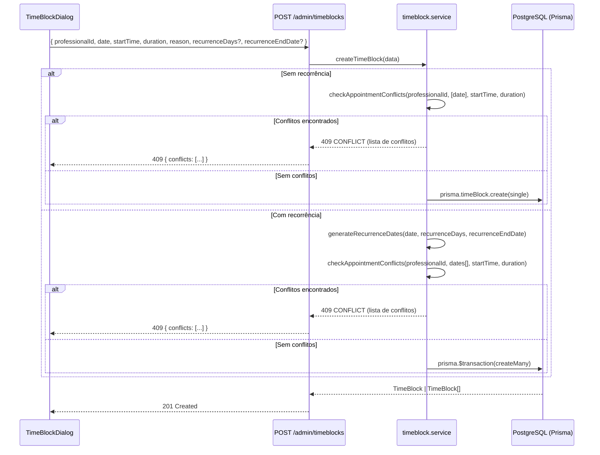
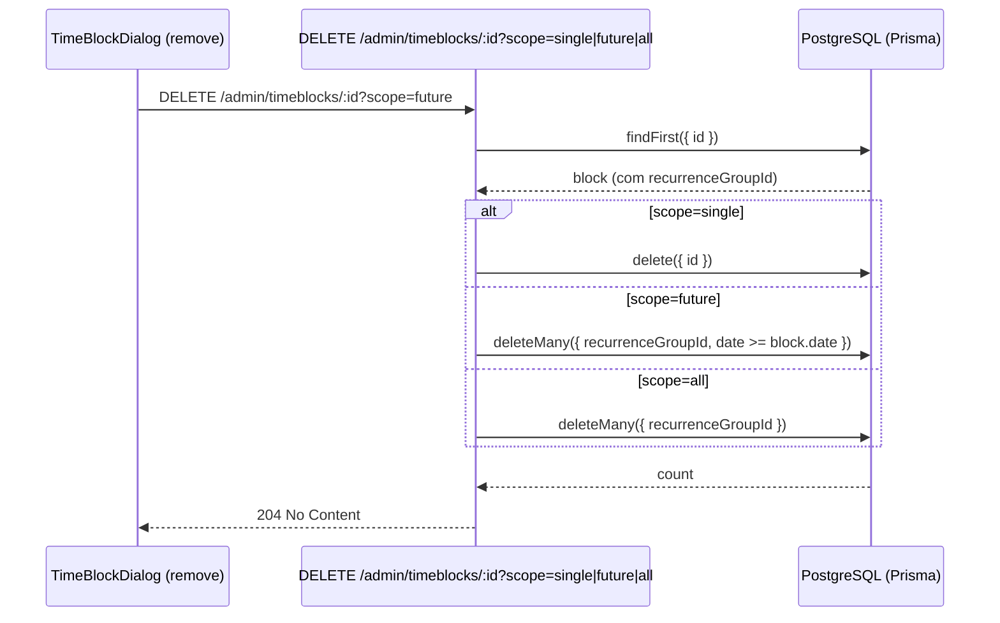

# Design — Bloqueios de Horário Recorrentes

## Visão Geral

Esta feature estende o modelo `TimeBlock` existente para suportar recorrência. Atualmente, cada bloqueio é criado individualmente. Com a recorrência, o usuário seleciona dias da semana e uma data limite, e o sistema gera automaticamente todas as ocorrências em uma transação atômica. A remoção suporta três escopos: individual, futuros e toda a série.

A implementação abrange dois workspaces:
- **core/** — Alteração do schema Prisma, lógica de geração de datas, endpoint de criação com recorrência e endpoint de remoção com escopo
- **backoffice/** — Campos de recorrência no `TimeBlockDialog`, indicadores visuais na agenda e dialog de remoção com opções de escopo

---

## Arquitetura





---

## Componentes e Interfaces

### Backend (core/)

#### 1. Schema Prisma — `TimeBlock` (alteração)

Três novos campos opcionais + índice:

```prisma
model TimeBlock {
  id                String   @id @default(uuid())
  shopId            String
  professionalId    String
  date              String
  startTime         String
  duration          Int
  reason            String?
  recurrenceGroupId String?
  recurrenceDays    String[]
  recurrenceEndDate String?
  createdAt         DateTime @default(now())

  shop         Shop         @relation(fields: [shopId], references: [id], onDelete: Cascade)
  professional Professional @relation(fields: [professionalId], references: [id], onDelete: Cascade)

  @@index([shopId, date])
  @@index([professionalId, date])
  @@index([recurrenceGroupId])
}
```

#### 2. Serviço — `timeblock.service.ts` (novo)

Função pura para geração de datas recorrentes, extraída para facilitar testes:

```typescript
interface RecurrenceInput {
  startDate: string;        // "YYYY-MM-DD"
  recurrenceDays: string[]; // ["Segunda", "Quarta", "Sexta"]
  recurrenceEndDate: string; // "YYYY-MM-DD"
}

function generateRecurrenceDates(input: RecurrenceInput): string[]
```

Lógica:
- Itera dia a dia de `startDate` até `recurrenceEndDate` (inclusive)
- Para cada dia, verifica se o nome do dia da semana está em `recurrenceDays`
- Retorna array de datas no formato `"YYYY-MM-DD"`

Mapeamento de dias (consistente com `availability.service.ts`):
```
0=Domingo, 1=Segunda, 2=Terça, 3=Quarta, 4=Quinta, 5=Sexta, 6=Sábado
```

Função de criação com transação:

```typescript
async function createTimeBlocks(data: {
  shopId: string;
  professionalId: string;
  date: string;
  startTime: string;
  duration: number;
  reason?: string;
  recurrenceDays?: string[];
  recurrenceEndDate?: string;
}): Promise<TimeBlock[]>
```

- Se `recurrenceDays` está vazio ou ausente → cria bloqueio único (comportamento atual)
- Se `recurrenceDays` tem itens → gera UUID para `recurrenceGroupId`, calcula datas, cria todos em `prisma.$transaction`

Função de validação de conflitos com agendamentos:

```typescript
interface AppointmentConflict {
  date: string;
  time: string;
  clientName: string;
  serviceName: string;
}

async function checkAppointmentConflicts(data: {
  professionalId: string;
  dates: string[];
  startTime: string;
  duration: number;
}): Promise<AppointmentConflict[]>
```

Lógica:
- Busca agendamentos do profissional nas datas geradas com status `confirmed` ou `pending`
- Para cada agendamento, verifica sobreposição de horário: `appointmentStart < blockEnd && blockStart < appointmentEnd`
- Retorna lista de conflitos com data, horário, nome do cliente e nome do serviço
- Se a lista não estiver vazia, lança `AppError(409, 'CONFLICT', ...)` com os conflitos no corpo da resposta

#### 3. Rota — `timeblocks.routes.ts` (alteração)

**POST /admin/timeblocks** — aceita novos campos opcionais:
```typescript
body: {
  professionalId: string;
  date: string;
  startTime: string;
  duration: number;
  reason?: string;
  recurrenceDays?: string[];    // novo
  recurrenceEndDate?: string;   // novo
}
```

**DELETE /admin/timeblocks/:id** — aceita query param `scope`:
```typescript
query: {
  scope?: "single" | "future" | "all"  // default: "single"
}
```

Lógica de remoção:
1. Busca o bloqueio pelo `id` + `shopId`
2. Se não encontrado → 404
3. Se `scope=single` ou bloqueio sem `recurrenceGroupId` → `delete({ id })`
4. Se `scope=future` → `deleteMany({ recurrenceGroupId, date: { gte: block.date } })`
5. Se `scope=all` → `deleteMany({ recurrenceGroupId })`
6. Operações de deleteMany executadas em `prisma.$transaction`

### Frontend (backoffice/)

#### 4. Tipo — `TimeBlock` (alteração em `types/timeBlock.ts`)

```typescript
export interface TimeBlock {
  id: string;
  shopId: string;
  professionalId: string;
  date: string;
  startTime: string;
  duration: number;
  reason: string | null;
  recurrenceGroupId: string | null;
  recurrenceDays: string[];
  recurrenceEndDate: string | null;
  createdAt: string;
  professionalName?: string;
}
```

#### 5. Serviço — `timeBlockService.ts` (alteração)

```typescript
create: async (data: {
  professionalId: string;
  date: string;
  startTime: string;
  duration: number;
  reason?: string;
  recurrenceDays?: string[];
  recurrenceEndDate?: string;
}): Promise<TimeBlock[]>

delete: async (id: string, scope?: "single" | "future" | "all"): Promise<void>
```

#### 6. Componente — `TimeBlockDialog` (alteração)

Modo criação — novos campos:
- **Recorrência**: grupo de 7 checkboxes (Seg–Dom) acima do campo "Motivo"
- **Até**: date picker condicional (visível quando ≥1 dia selecionado)
- Pré-seleciona o dia da semana correspondente à data do campo "Data e horário"
- Validação: Data_Limite obrigatória quando dias selecionados, deve ser futura e ≤ 1 ano
- **Tratamento de conflitos**: quando a API retorna 409 com `conflicts`, exibe lista amigável dos agendamentos conflitantes (data, horário, cliente, serviço) em um alerta dentro do dialog

Modo remoção — condicional:
- Se `timeBlock.recurrenceGroupId` existe → exibe 3 radio buttons:
  - "Remover apenas este"
  - "Remover este e os próximos"
  - "Remover todos da série"
- Se não tem `recurrenceGroupId` → confirmação simples (comportamento atual)

#### 7. Componente — `TimeBlockEvent` em `DayView.tsx` (alteração)

- Se `block.recurrenceGroupId` existe → adiciona ícone `Repeat` (lucide) ao lado do ícone `ShieldBan`
- Tooltip atualizado: "Bloqueado (recorrente): {reason}" ou "Bloqueado (recorrente)"

---

## Modelos de Dados

### TimeBlock (atualizado)

| Campo | Tipo | Obrigatório | Descrição |
|-------|------|-------------|-----------|
| id | String (UUID) | Sim | PK |
| shopId | String (UUID) | Sim | FK → Shop |
| professionalId | String (UUID) | Sim | FK → Professional |
| date | String | Sim | "YYYY-MM-DD" |
| startTime | String | Sim | "HH:mm" |
| duration | Int | Sim | Minutos |
| reason | String? | Não | Motivo do bloqueio |
| recurrenceGroupId | String? | Não | UUID compartilhado pela série |
| recurrenceDays | String[] | Não | Dias da semana (ex: ["Segunda", "Quarta"]) |
| recurrenceEndDate | String? | Não | Data limite "YYYY-MM-DD" |
| createdAt | DateTime | Sim | Auto |

### Payload de Criação (request body)

```json
{
  "professionalId": "uuid",
  "date": "2025-01-06",
  "startTime": "12:00",
  "duration": 60,
  "reason": "Almoço",
  "recurrenceDays": ["Segunda", "Quarta", "Sexta"],
  "recurrenceEndDate": "2025-03-31"
}
```

### Payload de Remoção (query param)

```
DELETE /admin/timeblocks/:id?scope=single|future|all
```

---

## Propriedades de Corretude

*Uma propriedade é uma característica ou comportamento que deve ser verdadeiro em todas as execuções válidas de um sistema — essencialmente, uma declaração formal sobre o que o sistema deve fazer. Propriedades servem como ponte entre especificações legíveis por humanos e garantias de corretude verificáveis por máquina.*

### Propriedade 1: Mapeamento data → dia da semana

*Para qualquer* data válida no formato "YYYY-MM-DD", o dia da semana pré-selecionado no campo de recorrência deve corresponder ao dia real da semana daquela data (usando o mapeamento Domingo=0...Sábado=6).

**Valida: Requisito 1.5**

### Propriedade 2: Validação da data limite

*Para qualquer* par (dataInicial, dataLimite), se dataLimite ≤ dataInicial, o sistema deve rejeitar a criação. Se dataLimite > dataInicial e dataLimite ≤ dataInicial + 1 ano, o sistema deve aceitar.

**Valida: Requisitos 2.2, 2.4**

### Propriedade 3: Corretude da geração de datas recorrentes

*Para qualquer* combinação válida de (dataInicial, diasRecorrência, dataLimite), todas as datas geradas por `generateRecurrenceDates` devem satisfazer simultaneamente:
1. Cada data está no intervalo [dataInicial, dataLimite]
2. Cada data cai em um dos dias da semana especificados em diasRecorrência
3. Não existe nenhuma data no intervalo que caia em um dia selecionado e não esteja na lista gerada (completude)

**Valida: Requisito 3.1**

### Propriedade 4: Invariante de metadados da série recorrente

*Para qualquer* série recorrente criada, todos os bloqueios gerados devem compartilhar o mesmo `recurrenceGroupId` (UUID não-nulo) e conter os mesmos valores de `recurrenceDays` e `recurrenceEndDate`.

**Valida: Requisitos 3.2, 3.3**

### Propriedade 5: Remoção com escopo single preserva os demais

*Para qualquer* série recorrente com N bloqueios (N ≥ 2) e qualquer bloqueio selecionado da série, a remoção com `scope=single` deve resultar em exatamente N-1 bloqueios restantes na série, e o bloqueio removido não deve mais existir.

**Valida: Requisitos 4.2, 7.2**

### Propriedade 6: Remoção com escopo future remove corretamente

*Para qualquer* série recorrente e qualquer bloqueio selecionado com data D, a remoção com `scope=future` deve remover exatamente os bloqueios da série cuja data ≥ D, e preservar todos os bloqueios cuja data < D.

**Valida: Requisitos 4.3, 7.3**

### Propriedade 7: Remoção com escopo all remove toda a série

*Para qualquer* série recorrente e qualquer bloqueio selecionado da série, a remoção com `scope=all` deve resultar em zero bloqueios restantes com o mesmo `recurrenceGroupId`.

**Valida: Requisitos 4.4, 7.4**

### Propriedade 8: Detecção de conflitos com agendamentos

*Para qualquer* bloqueio (único ou recorrente) com intervalo [startTime, startTime+duration] e qualquer agendamento existente do mesmo profissional na mesma data com intervalo [appointmentTime, appointmentTime+appointmentDuration], se os intervalos se sobrepõem (appointmentStart < blockEnd ∧ blockStart < appointmentEnd), o sistema deve detectar o conflito e incluí-lo na resposta de erro.

**Valida: Requisito 7.1, 7.2, 7.5**

---

| Cenário | Código | Mensagem |
|---------|--------|----------|
| Campos obrigatórios ausentes | 400 VALIDATION_ERROR | "professionalId, date, startTime e duration são obrigatórios" |
| recurrenceDays sem recurrenceEndDate | 400 VALIDATION_ERROR | "recurrenceEndDate é obrigatório quando recurrenceDays está preenchido" |
| recurrenceEndDate ≤ date | 400 VALIDATION_ERROR | "recurrenceEndDate deve ser posterior à data do bloqueio" |
| recurrenceEndDate > 1 ano | 400 VALIDATION_ERROR | "recurrenceEndDate não pode exceder 1 ano a partir da data atual" |
| Conflito com agendamentos existentes | 409 CONFLICT | "Existem agendamentos que conflitam com o bloqueio" + `conflicts: [{ date, time, clientName, serviceName }]` |
| scope inválido | 400 VALIDATION_ERROR | "scope deve ser 'single', 'future' ou 'all'" |
| Bloqueio não encontrado (DELETE) | 404 NOT_FOUND | "Bloqueio não encontrado" |
| Falha na transação de criação | 500 INTERNAL_ERROR | "Erro ao criar bloqueios recorrentes" |

---

## Estratégia de Testes

### Testes Unitários

- `generateRecurrenceDates`: casos específicos (1 dia, todos os dias, fim de semana, mês completo)
- Validação de inputs (data limite no passado, sem dias selecionados, scope inválido)
- Mapeamento dia da semana ↔ nome em português
- Fallback de remoção (bloqueio sem recurrenceGroupId com scope=future/all)

### Testes de Propriedade (PBT)

Biblioteca: **fast-check** (já presente no projeto)

Cada propriedade do design será implementada como um teste de propriedade com mínimo de 100 iterações:

| Propriedade | Gerador | Verificação |
|-------------|---------|-------------|
| P1: Data → dia da semana | Datas aleatórias válidas | `getDayName(date) === expectedDay` |
| P2: Validação data limite | Pares (dataInicial, offset em dias) | Rejeição/aceitação conforme regras |
| P3: Geração de datas | (dataInicial, subconjunto de dias, offset 1-365) | Todas as datas no range, nos dias certos, sem faltas |
| P4: Metadados da série | Inputs de criação recorrente | Todos os bloqueios com mesmo groupId/days/endDate |
| P5: Remoção single | Série gerada + índice aleatório | N-1 bloqueios restantes |
| P6: Remoção future | Série gerada + índice aleatório | Bloqueios com date < D preservados |
| P7: Remoção all | Série gerada + índice aleatório | Zero bloqueios com mesmo groupId |
| P8: Detecção de conflitos | Bloqueio + agendamento com horários sobrepostos/não-sobrepostos | Conflito detectado sse intervalos se sobrepõem |

Tag format: `Feature: recurring-time-blocks, Property {N}: {título}`

### Testes de Integração

- Criação de série recorrente via API (POST) e verificação no banco
- Remoção com cada escopo via API (DELETE) e verificação no banco
- Transação atômica: simular falha e verificar rollback
- Backward compatibility: criação sem recorrência continua funcionando
